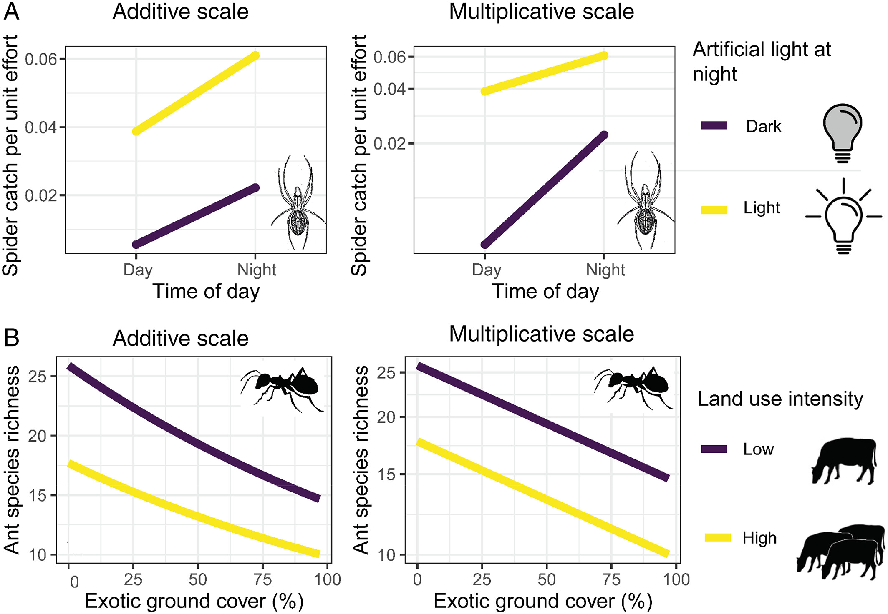

```{r}
#| echo: false
library(tidyverse)
library(palmerpenguins)
theme_set(theme_minimal(base_size = 15))
pinguins <- penguins |> drop_na(body_mass_g, species, sex, flipper_length_mm)
lagartos <- read_tsv("../dados/camila_cauda_lagartos.txt", show_col_types = FALSE) |>
  drop_na(SVL, Autotomized_tail_length, Sex)
```

## Onde estamos no ciclo PPDAC

```{r}
#| echo: false
#| fig-width: 5.6
#| fig-height: 4.5
#| out-width: "36%"
#| fig-align: center
source("../R/ppdac.R")
ppdac_plot(destaque = c("An\u00e1lise"))
```

Continuamos na **Análise**. O que muda hoje vem inteiramente do **Plano**: quantos fatores, balanceado ou não, com ou sem covariável.

---

## Onde paramos {.secao}

Ontem: teste t é `lm(y ~ grupo)` com uma coluna 0/1.

::: {.definicao}
Hoje: mais colunas na mesma matriz. **Nenhum conceito novo de
inferência.**
:::

- 3 grupos em vez de 2 → ANOVA de um fator
- 2 fatores → ANOVA fatorial
- fator + covariável contínua → ANCOVA
- o produto das colunas → interação

---

## Hoje

1. *Productive failure* de abertura
2. ANOVA de um fator como `lm()`
3. De onde vem a tabela de ANOVA
4. Dois fatores e interação
5. **Intervalo**
6. ANCOVA e homogeneidade de inclinações
7. Somas de quadrados I, II e III
8. Comparações com `emmeans`
9. Como relatar

---

## *Productive failure*

Vocês têm 223 lagartos *Coleodactylus meridionalis*, com sexo,
comprimento rostro-cloacal (SVL) e comprimento da cauda regenerada após
autotomia.

::: {.definicao}
**Pergunta:** machos e fêmeas regeneram cauda de forma diferente?
:::

Em grupos, 10 minutos:

1. que análise? escrevam a fórmula;
2. o que "de forma diferente" significa exatamente — mesma média? mesma
   relação com o tamanho do corpo?
3. o que pode dar errado?

---

# 1. ANOVA de um fator {.secao}

---

## Três espécies, uma resposta

```{r}
#| fig-height: 3.2
#| echo: false
ggplot(pinguins, aes(species, body_mass_g, fill = species)) +
  geom_boxplot(alpha = .7, show.legend = FALSE) +
  scale_fill_manual(values = c("#1c6e8c", "#96661f", "#4f7057")) +
  labs(x = NULL, y = "Massa (g)")
```

---

## Os dois caminhos, lado a lado {.smaller}

```{r}
m <- lm(body_mass_g ~ species, data = pinguins)
anova(m)
```

```{r}
summary(aov(body_mass_g ~ species, data = pinguins))
```

::: {.definicao}
`aov()` é literalmente uma casca em volta de `lm()`. Mesmo *F*, mesmos
graus de liberdade, mesmo *p*.
:::

---

## Primeiro, a tabela de códigos {.smaller .tabela-grande}

No Encontro 2 uma coluna 0/1 bastava, porque havia dois grupos. Com três,
o R cria **duas** colunas:

| Espécie | `speciesChinstrap` | `speciesGentoo` |
|:--|:--:|:--:|
| `Adelie` (referência) | 0 | 0 |
| `Chinstrap` | 1 | 0 |
| `Gentoo` | 0 | 1 |

::: {.definicao}
A referência **não ganha coluna própria**. Ela é a linha de zeros — o caso
que sobra quando todas as outras colunas valem 0.
:::

Regra geral: $k$ grupos, $k-1$ colunas.

---

## A matriz, uma linha de cada espécie {.smaller}

```{r}
X <- model.matrix(m)
X[c(1, 266, 147), ]   # 1 é Adelie, 266 é Chinstrap, 147 é Gentoo
```

A primeira coluna é só de 1: é o intercepto. As outras duas são a tabela
do slide anterior, repetida uma vez por pinguim.

---

## Substituindo, uma espécie de cada vez {.smaller}

O modelo é $\hat{y} = \beta_0 \cdot 1 + \beta_1 x_1 + \beta_2 x_2$. Basta
pôr a linha de cada espécie no lugar de $x_1$ e $x_2$:

**Adelie** — linha $(1, 0, 0)$:
$$\hat{y} = \beta_0 + \beta_1 \cdot 0 + \beta_2 \cdot 0 = \beta_0$$

**Chinstrap** — linha $(1, 1, 0)$:
$$\hat{y} = \beta_0 + \beta_1$$

**Gentoo** — linha $(1, 0, 1)$:
$$\hat{y} = \beta_0 + \beta_2$$

::: {.definicao}
$\beta_0$ é a **média de Adelie**. $\beta_1$ e $\beta_2$ são
**diferenças** em relação a ela — nenhum dos dois é a média do próprio
grupo.
:::

---

## Conferindo na mão {.smaller}

```{r}
coef(m)

pinguins |>
  group_by(species) |>
  summarise(media = mean(body_mass_g)) |>
  mutate(diferenca_para_Adelie = media - first(media))
```

O intercepto é 3706 g, que é a média de `Adelie`. O coeficiente de
`Gentoo` é 1386 g, que é 5092 − 3706. **Os mesmos números, nas duas
tabelas.**

---

## Por que $k-1$ e não $k$ {.smaller}

E se déssemos uma coluna também para `Adelie`?

```{r}
X3 <- cbind(X, speciesAdelie = as.numeric(pinguins$species == "Adelie"))

c(colunas = ncol(X3), posto = qr(X3)$rank)
```

Quatro colunas, posto 3: uma delas é redundante. E dá para ver qual — as
três colunas de espécie **somam exatamente a coluna do intercepto**, já
que todo pinguim é de uma espécie e só uma.

::: {.nota}
Nesse caso o R não erra: ele descarta uma e devolve `NA` no coeficiente
correspondente. Mas a escolha de qual descartar passa a ser dele, e não
sua — e é por isso que existe a ideia de nível de referência.
:::

---

# 2. De onde vem a tabela {.secao}

---

## Decomposição da variação

$$
\underbrace{\sum (y_i - \bar{y})^2}_{\text{SQ total}} =
\underbrace{\sum (\hat{y}_i - \bar{y})^2}_{\text{SQ do modelo}} +
\underbrace{\sum (y_i - \hat{y}_i)^2}_{\text{SQ residual}}
$$

```{r}
sq_total <- sum((pinguins$body_mass_g - mean(pinguins$body_mass_g))^2)
sq_res   <- sum(resid(m)^2)
c(total = sq_total, modelo = sq_total - sq_res, residual = sq_res)
```

Compare com a coluna `Sum Sq` da tabela de ANOVA. São os mesmos números.

---

## O que o *F* é

$$
F = \frac{\text{SQ do modelo} / \text{gl do modelo}}
         {\text{SQ residual} / \text{gl residual}}
$$

::: {.definicao}
Variância explicada por observação de modelo, dividida por variância não
explicada por observação de resíduo. Se o modelo não explica nada, a
razão flutua em torno de 1.
:::

E $R^2$ é simplesmente SQ do modelo / SQ total:

```{r}
c(r2_manual = (sq_total - sq_res) / sq_total, r2_lm = summary(m)$r.squared)
```

---

## Por que não fazer três testes t

Com 3 grupos há 3 comparações; com 5 grupos, 10.

```{r}
#| echo: false
tibble(grupos = 2:8, comparacoes = choose(2:8, 2),
       `P(ao menos 1 falso positivo)` = round(1 - 0.95^choose(2:8, 2), 2))
```

::: {.definicao}
A ANOVA faz **um** teste. Quando ele indica diferença, aí sim vamos às
comparações específicas — planejadas de preferência, e com correção.
:::

---

# 3. Dois fatores e interação {.secao}

---

## A pergunta

Espécie e sexo afetam a massa. **O efeito do sexo é o mesmo nas três
espécies?**

```{r}
#| fig-height: 3.1
#| echo: false
pinguins |>
  group_by(species, sex) |>
  summarise(massa = mean(body_mass_g), .groups = "drop") |>
  ggplot(aes(species, massa, colour = sex, group = sex)) +
  geom_point(size = 3) + geom_line(linewidth = 1) +
  scale_colour_manual(values = c("#1c6e8c", "#96661f")) +
  labs(x = NULL, y = "Massa média (g)", colour = NULL)
```

Retas não paralelas = interação.

---

## Aditivo e com interação

```{r}
m_adit <- lm(body_mass_g ~ species + sex, data = pinguins)
m_int  <- lm(body_mass_g ~ species * sex, data = pinguins)
anova(m_adit, m_int)
```

::: {.definicao}
`species * sex` é abreviação de `species + sex + species:sex`. O teste
compara os dois modelos: vale a pena gastar 2 graus de liberdade com a
interação?
:::

---

## A interação na matriz

```{r}
colnames(model.matrix(m_int))
```

As duas últimas colunas são **produtos** das anteriores: valem 1 apenas
para machos de `Chinstrap` e machos de `Gentoo`.

---

## Interpretando com interação

```{r}
round(coef(m_int), 1)
```

::: {.definicao}
Com `contr.treatment`, `sexmale` **não** é o efeito médio do sexo: é o
efeito do sexo **em `Adelie`**, a referência. O efeito em `Gentoo` é
`sexmale` + `speciesGentoo:sexmale`.
:::

Foi por isso que o Encontro 2 insistiu em codificação de fatores.

---

## Interação é resultado, não estorvo

::: {.definicao}
Em ecologia, a interação costuma ser **a pergunta**, não um incômodo: o
efeito da temperatura depende da altitude? O efeito do predador depende
da densidade de refúgios?
:::

Três regras práticas:

- não interprete efeitos principais isoladamente quando a interação é
  relevante — interprete o gráfico;
- não remova a interação só porque o *p* passou de 0,05. A decisão é da
  pergunta, não do limiar;
- **olhe nas duas direções.** "O efeito da temperatura depende da
  altitude" e "o efeito da altitude depende da temperatura" são o **mesmo
  termo** do modelo. Escolher só uma leitura é escolha de narrativa, e
  costuma ser feita sem perceber.

---

## A interação depende da escala {.smaller}

Spake et al. (2023) mostram que duas propriedades passam batidas quando se
interpreta interação em ecologia. A segunda é a simetria do slide anterior.
A primeira é mais incômoda: a **escala de medida** — nas palavras deles,

> whether a response is analysed on an additive or multiplicative scale,
> such as a ratio or logarithmic scale.

::: {.definicao}
A mesma relação pode **ter** interação na escala aditiva e **não ter** na
multiplicativa, ou o contrário. Não é erro de análise: são perguntas
diferentes. "A diferença entre tratamentos é a mesma?" e "a *razão* entre
tratamentos é a mesma?" não são a mesma pergunta.
:::

Guardem isto para o **Encontro 4**, quando a função de ligação entrar: um
GLM com ligação log modela a escala multiplicativa por construção. A
escolha da família decide, sem avisar, em que escala você está procurando
interação.

---

## Vendo acontecer {.smaller}

{fig-align="center" height="410"}

Em **B**: riqueza de formigas contra cobertura de gramíneas exóticas, em
dois níveis de uso da terra. À esquerda, escala aditiva — as linhas
**convergem**, há interação. À direita, os **mesmos dados** em escala
multiplicativa — ficam **paralelas**, não há.

::: {.nota}
Figura 4 de Spake, R. et al. 2023, *Biological Reviews* 98:983–1002,
[doi:10.1111/brv.12939](https://doi.org/10.1111/brv.12939). Reproduzida
sob [CC BY 4.0](https://creativecommons.org/licenses/by/4.0/), sem
alterações.
:::

---

## Três erros com nome {.smaller .tabela-grande}

O artigo batiza os três modos de errar, e os nomes ajudam a lembrar:

| | O que se erra |
|:--|:--|
| **Tipo D** | a *detecção* e a magnitude — achar interação onde a escala a criou, ou não achar onde a escala a escondeu |
| **Tipo S** | o **sinal** da modificação do efeito |
| **Tipo A** | o processo por trás — atribuir a um mecanismo biológico o que é artefato de escala |

::: {.nota}
Eles mostram que **meta-análise** é especialmente vulnerável aos três, o
que importa para quem for por esse caminho: razão de chances e diferença
de médias padronizada vivem em escalas diferentes, e a mesma literatura
pode dar respostas opostas sobre dependência de contexto conforme a
métrica escolhida.
:::

---

# Intervalo {.secao}

15 minutos.

Na volta: ANCOVA, e por que homogeneidade de inclinações é a ausência de uma interação.

---

# 4. ANCOVA {.secao}

---

## Fator + covariável contínua

Voltando aos lagartos: a cauda regenerada depende do tamanho do corpo. E
o sexo?

```{r}
#| fig-height: 3.0
#| echo: false
ggplot(lagartos, aes(SVL, Autotomized_tail_length, colour = Sex)) +
  geom_point(alpha = .6) +
  geom_smooth(method = "lm", se = FALSE) +
  scale_colour_manual(values = c("#1c6e8c", "#96661f")) +
  labs(x = "SVL (mm)", y = "Cauda autotomizada (mm)", colour = NULL)
```

---

## O modelo

```{r}
anc <- lm(Autotomized_tail_length ~ SVL + Sex, data = lagartos)
round(coef(anc), 2)
```

Duas retas **paralelas**: mesma inclinação em relação ao SVL, interceptos
diferentes por sexo.

::: {.definicao}
A célebre "premissa de homogeneidade das inclinações" da ANCOVA é
exatamente isto: a **ausência da interação** `SVL:Sex`. Não é uma
premissa misteriosa — é uma escolha de modelo, e ela é testável.
:::

---

## Testando a premissa

```{r}
anc_int <- lm(Autotomized_tail_length ~ SVL * Sex, data = lagartos)
anova(anc, anc_int)
```

```{r}
round(coef(anc_int), 2)
```

---

## Centrar muda o que o coeficiente significa

```{r}
lagartos <- lagartos |> mutate(SVL_c = SVL - mean(SVL))
round(coef(lm(Autotomized_tail_length ~ SVL_c * Sex, data = lagartos)), 2)
```

::: {.definicao}
Sem centrar, `SexMale` é a diferença entre sexos **em SVL = 0** — um
lagarto de tamanho zero. Centrando, passa a ser a diferença **num lagarto
de tamanho médio**, que é a comparação que interessa.
:::

Com interação no modelo, **sempre centre a covariável** antes de
interpretar efeitos principais.

---

# 5. Somas de quadrados {.secao}

---

## Por que existem três tipos

Com delineamento **balanceado**, os fatores são ortogonais e a ordem não
importa. Com **desbalanceado** — que é o caso de quase todo dado de campo
—, a variação compartilhada entre fatores precisa ser atribuída a alguém.

```{r}
table(pinguins$species, pinguins$sex)
```

---

## Tipo I: sequencial

```{r}
anova(lm(body_mass_g ~ species + flipper_length_mm, data = pinguins))[, 1:2]
anova(lm(body_mass_g ~ flipper_length_mm + species, data = pinguins))[, 1:2]
```

::: {.definicao}
A mesma dupla de preditoras, em ordem trocada, dá somas de quadrados
diferentes. O tipo I atribui ao **primeiro** tudo o que é compartilhado.
:::

---

## Tipos II e III

```{r}
car::Anova(m_int, type = "II")
```

- **Tipo II**: cada efeito principal ajustado pelos outros efeitos
  principais, ignorando interações. Bom quando a interação é irrelevante.
- **Tipo III**: cada termo ajustado por **todos** os outros, interações
  inclusive. Exige contrastes de soma zero.

---

## Tipo III exige `contr.sum`

```{r}
m_int3 <- lm(body_mass_g ~ species * sex, data = pinguins,
             contrasts = list(species = "contr.sum", sex = "contr.sum"))
car::Anova(m_int3, type = "III")[1:3, ]
```

::: {.definicao}
Rodar tipo III com o `contr.treatment` padrão do R produz um teste de
efeito principal que **não significa o que você pensa**. É um dos erros
mais comuns em artigos de ecologia.
:::

---

## Qual usar

| Situação | Tipo |
|---|---|
| Balanceado | tanto faz — dão o mesmo |
| Desbalanceado, sem interação relevante | II |
| Desbalanceado, interação é a pergunta | III, com `contr.sum` |
| Você quer ordem de entrada deliberada (hierárquica) | I, e diga isso no texto |

**Sempre relate qual tipo usou.** Sem isso, a tabela não é reproduzível.

---

# 6. Comparações {.secao}

---

## `emmeans`: médias marginais estimadas

```{r}
library(emmeans)
emmeans(m_int, ~ sex | species)
```

Médias ajustadas pelo modelo — não as médias brutas dos grupos.

---

## Contrastes

```{r}
pairs(emmeans(m_int, ~ sex | species))
```

Aqui cada comparação é uma pergunta biológica específica: dimorfismo
sexual dentro de cada espécie.

---

## Planejada × post-hoc

::: {.definicao}
**Planejada**: você sabia, antes de coletar, quais comparações
interessavam. Poucas, e mais poderosas.

**Post-hoc**: você olhou os dados e decidiu o que comparar. Todas contra
todas, com correção mais severa.
:::

```{r}
pairs(emmeans(m, ~ species), adjust = "tukey")
```

---

## O que a correção faz

- **Bonferroni** — divide $\alpha$ pelo número de testes. Conservadora.
- **Tukey** — desenhada para todas as comparações par a par.
- **FDR (Benjamini–Hochberg)** — controla a proporção esperada de falsos
  positivos entre as rejeições. Sensata quando há muitos testes.

::: {.nota}
Nenhuma correção conserta o problema de ter decidido as comparações
depois de ver os dados. Isso é conteúdo do Encontro 1.
:::

---

# 7. Como relatar {.secao}

---

## O que precisa estar no texto

Seguindo Davis & Kay (2023):

1. **Objetivo** — a comparação que interessa, em uma frase.
2. **Variáveis** — resposta com unidade; fatores com número de níveis e
   quantas observações por nível.
3. **Método** — "modelo linear com espécie, sexo e sua interação; somas
   de quadrados do tipo III com contrastes de soma zero; comparações
   par a par com correção de Tukey via `emmeans`".
4. **Implementação** — versões de R e pacotes.

---

## Tabela ou texto?

::: {.definicao}
Uma tabela de ANOVA sozinha não responde à pergunta biológica. Ela diz
"há diferença"; o leitor quer saber **qual** e **de quanto**.
:::

Relate sempre: a estimativa da diferença, com unidade e intervalo.

```{r}
confint(pairs(emmeans(m_int, ~ sex | species)))[, c(1, 2, 3, 6, 7)]
```

---

# Fechamento {.secao}

---

## O que fica de hoje

1. ANOVA e ANCOVA são `lm()` com mais colunas — e `aov()` é uma casca.
2. A tabela de ANOVA é uma decomposição do **mesmo ajuste**.
3. Interação é o produto de colunas — e em ecologia costuma ser a
   pergunta.
4. Com interação, centre covariáveis e desconfie de efeitos principais.
5. Somas de quadrados I, II e III diferem em dado desbalanceado; tipo III
   exige `contr.sum`.
6. Relate a **estimativa com intervalo**, não só o *p*.

---

## Prática (o resto do bloco)

1. Nos seus dados, ajuste um modelo com dois fatores e interação.
2. Compare com o aditivo usando `anova()`.
3. Faça o gráfico de médias por grupo e diga se as retas são paralelas.
4. Rode `car::Anova()` nos tipos II e III e explique qualquer diferença.
5. Use `emmeans` para a comparação que **interessa à sua pergunta** — só
   ela.

---

## Para a tarde

**Leitura:** Agresti (2015), cap. 4.

**À tarde:** saímos do mundo gaussiano. Que processo gerou os seus dados?

---

## Referências

::: {.nota}
- Quinn, G.P. & Keough, M.J. 2023. [*Experimental Design and Data Analysis for Biologists*](https://doi.org/10.1017/9781139568173). 2ª ed. Cambridge University Press.
- Gelman, A.; Hill, J. & Vehtari, A. 2020. [*Regression and Other Stories*](https://avehtari.github.io/ROS-Examples/). Cambridge University Press. — código e exemplos no site.
- Agresti, A. 2015. [*Foundations of Linear and Generalized Linear Models*](https://www.wiley.com/en-us/Foundations+of+Linear+and+Generalized+Linear+Models-p-9781118730034). Wiley.
- Spake, R.; Bowler, D.E.; Callaghan, C.T.; Blowes, S.A.; Doncaster, C.P.; Antão, L.H.; Nakagawa, S.; McElreath, R. & Chase, J.M. 2023. [Understanding ‘it depends’ in ecology: a guide to hypothesising, visualising and interpreting statistical interactions](https://doi.org/10.1111/brv.12939). *Biological Reviews* 98:983–1002. Acesso aberto.
- Davis, S. & Kay, M. 2023. [Statistical reporting checklist](https://doi.org/10.1002/ecs2.4539). *Ecosphere*.
- Lenth, R. [`emmeans`: estimated marginal means](https://cran.r-project.org/package=emmeans).
- da Silva, F.R.; Gonçalves-Souza, T.; Paterno, G.; **Provete, D.B.** & Vancine, M.A. 2022. [*Análises Ecológicas no R*](https://analises-ecologicas.com). NUPEEA.
:::
