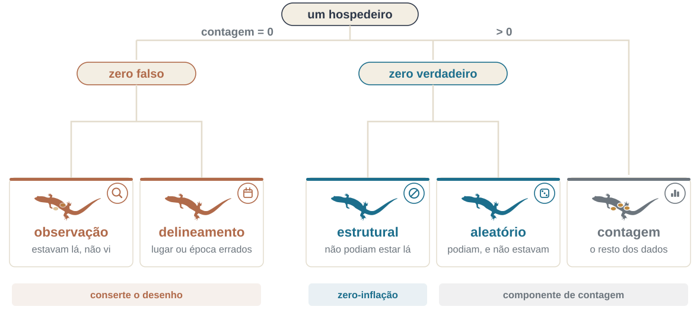

```{r}
#| echo: false
library(tidyverse)
library(bbmle)
theme_set(theme_minimal(base_size = 15))
RK <- read.delim("../dados/RoadKills.txt")
parasitas <- read_tsv("../dados/Planilha_Pentastomida.txt", show_col_types = FALSE) |>
  rename(id = 1) |>
  drop_na(Raillietiella_mottae, CRC, Sexo, Especie)
mela <- read_delim("../dados/NA.csv", delim = ";", show_col_types = FALSE)
```

## Onde estamos no ciclo PPDAC

```{r}
#| echo: false
#| fig-width: 5.6
#| fig-height: 4.5
#| out-width: "36%"
#| fig-align: center
source("../R/ppdac.R")
ppdac_plot(destaque = c("Dados", "An\u00e1lise"))
```

Quando o diagnóstico falha, o ciclo manda voltar aos **Dados** — e às vezes ao **Plano**. Excesso de zeros costuma ser um fato sobre a coleta, não sobre o modelo.

---

## O problema de ontem {.secao}

```{r}
#| echo: false
m_rk <- glm(TOT.N ~ D.PARK, family = poisson, data = RK)
c(deviance = round(deviance(m_rk), 1), gl = df.residual(m_rk),
  razao = round(deviance(m_rk)/df.residual(m_rk), 2))
```

::: {.definicao}
A Poisson assume variância = média. Aqui a variância é quase **8 vezes**
maior do que o modelo supõe. Todo erro-padrão do modelo está subestimado,
e todo valor de *p* está otimista.
:::

Esta tarde: como detectar, o que causa, e o que fazer.

---

## Hoje

1. *Productive failure*
2. Por que os resíduos comuns não servem para GLM
3. `DHARMa`: resíduos quantílicos simulados
4. Sobredispersão: causas e remédios
5. **Intervalo**
6. Zeros: estruturais e amostrais; ZIP, ZINB e *hurdle*
7. Respostas ordinais
8. Como relatar

---

## *Productive failure*

De volta aos pentastomídeos de terça-feira: *Raillietiella mottae* em
`r nrow(parasitas)` lagartos de duas espécies.

```{r}
#| echo: false
#| fig-height: 2.5
ggplot(parasitas, aes(Raillietiella_mottae)) +
  geom_bar(fill = "#1c6e8c") +
  labs(x = "Parasitas por hospedeiro", y = "Nº de lagartos")
```

`r round(100*mean(parasitas$Raillietiella_mottae == 0))` % dos lagartos
não têm nenhum parasita. **Em grupos:** de onde vêm esses zeros? Todos
significam a mesma coisa?

---

# 1. Diagnóstico {.secao}

---

## Os resíduos comuns mentem

```{r}
#| fig-height: 3.2
#| echo: false
tibble(fit = fitted(m_rk), res = resid(m_rk, type = "deviance")) |>
  ggplot(aes(fit, res)) +
  geom_point(colour = "#1c6e8c") +
  geom_hline(yintercept = 0, colour = "#96661f") +
  labs(x = "Valor predito", y = "Resíduo de deviance")
```

Esse padrão em faixas é **esperado** num GLM com contagens baixas: a
resposta é discreta. Não dá para julgar se é bom ou ruim só olhando.

---

## Pearson, deviance, quantílico

| Tipo | Ideia | Problema |
|---|---|---|
| Pearson | $(y - \hat{\mu})/\sqrt{V(\hat{\mu})}$ | distribuição desconhecida |
| *deviance* | contribuição de cada ponto à *deviance* | idem |
| **quantílico simulado** | posição do valor observado na distribuição preditiva | **nenhum** — é uniforme se o modelo está certo |

::: {.definicao}
A ideia do `DHARMa`: simule muitos conjuntos de dados a partir do modelo
ajustado e veja em que quantil dessa distribuição cai cada observação.
Se o modelo está certo, esses quantis são uniformes entre 0 e 1 — seja
qual for a família.
:::

---

## Fazendo na mão, para entender {.smaller}

```{r}
#| fig-height: 2.9
set.seed(2026)
sim <- replicate(1000, rpois(nrow(RK), lambda = fitted(m_rk)))
quantis <- map_dbl(seq_len(nrow(RK)), \(i) mean(sim[i, ] < RK$TOT.N[i]))

ggplot(tibble(quantis), aes(quantis)) +
  geom_histogram(bins = 20, fill = "#1c6e8c", colour = "white") +
  labs(x = "Quantil simulado", y = NULL)
```

Deveria ser plano. O acúmulo nas pontas é a assinatura da sobredispersão:
o modelo prevê variação de menos.

---

## Com o `DHARMa` {.smaller}

```{r}
#| fig-height: 3.2
library(DHARMa)

set.seed(2026)            # o DHARMa simula: sem semente, cada render difere
res <- simulateResiduals(m_rk, n = 1000)
plot(res)                 # QQ uniforme + resíduo contra predito
```

::: {.nota}
Três razões para usar o `DHARMa` em vez dos gráficos do `plot()`:
funciona para qualquer família, funciona para modelos mistos (Encontros 7
e 8), e devolve testes com valor de *p* em vez de "parece um padrão?".
:::

---

## Os mesmos diagnósticos, com valor de *p* {.smaller .codigo-compacto}

```{r}
testDispersion(res, plot = FALSE)       # sobredispersão
testZeroInflation(res, plot = FALSE)    # excesso de zeros
testOutliers(res, plot = FALSE)
```

---

## Lendo os gráficos do `DHARMa`

- **QQ uniforme** — os pontos devem seguir a diagonal. Desvio em S =
  dispersão errada.
- **Resíduo contra predito** — as três linhas de quantil (0,25, 0,50,
  0,75) devem ser horizontais. Inclinação = relação média–variância
  errada ou termo faltando.
- **`testDispersion`** — razão > 1 é sobredispersão; < 1 é
  subdispersão (mais raro, e também um problema).

---

# 2. Sobredispersão {.secao}

---

## Quatro causas, quatro remédios

| Causa | Sinal | O que fazer |
|---|---|---|
| Falta uma covariável importante | resíduo estruturado | incluir a covariável |
| Falta um termo não linear | curvatura no resíduo | `poly()`, `s()` |
| Observações agrupadas | grupos com médias distintas | efeito aleatório (E7) |
| Excesso de zeros | pico em zero | ZI ou *hurdle* |
| Variação genuína além da Poisson | nada acima explica | binomial negativa |

::: {.definicao}
Sobredispersão é quase sempre **sintoma**, não doença. Trocar a
distribuição sem investigar a causa esconde o problema em vez de
resolvê-lo.
:::

---

## O tamanho da razão já diz qual causa {.smaller}

A razão de *deviance* do nosso Poisson foi **7,8**. Burnham & Anderson
tratam esse número como diagnóstico, não como mero fator de correção:

> "We might expect $c > 1$ with real data but would not expect $c$ to
> exceed about 4 if model structure is acceptable and only overdispersion
> is affecting $c$. Substantially larger values of $c$ (say, 6–10) are
> usually caused partly by a model structure that is inadequate."

::: {.nota}
Ou seja: 7,8 aponta para a **primeira** linha da tabela — falta estrutura —
antes de apontar para a quarta. Trocar de família conserta o erro-padrão
sem consertar o modelo. Voltamos a isso no Encontro 7, quando a estrutura
que falta for o agrupamento.
:::

::: {.ref}
Burnham & Anderson (2002), §2.5, p. 68.
:::

---

## Remédio 1: quasi-Poisson

```{r}
m_quasi <- glm(TOT.N ~ D.PARK, family = quasipoisson, data = RK)
round(summary(m_quasi)$coefficients, 5)
```

Multiplica todos os erros-padrão por $\sqrt{\hat{\phi}}$. As estimativas
não mudam.

::: {.nota}
Não é uma distribuição de verdade — é um ajuste dos erros-padrão. Por
isso **não tem verossimilhança nem AIC**, o que atrapalha no Encontro 9.
:::

---

## Remédio 2: binomial negativa

```{r}
library(MASS)   # atenção: MASS::select mascara dplyr::select
m_nb <- glm.nb(TOT.N ~ D.PARK, data = RK)
c(theta = round(m_nb$theta, 2),
  razao_deviance = round(deviance(m_nb)/df.residual(m_nb), 2))

ICtab(list(poisson = m_rk, nb = m_nb), type = "AICc", weights = TRUE,
      delta = TRUE, base = TRUE, mnames = c("poisson", "nb"))
```

::: {.definicao}
$\theta$ controla o excesso de variância: $\mathrm{Var} = \mu +
\mu^2/\theta$. A razão de *deviance* cai de 7,8 para 1,1, e a binomial
negativa fica 241 unidades de AICc abaixo da Poisson — todo o peso de
Akaike.
:::

---

## O efeito prático nos erros-padrão

```{r}
bind_rows(
  broom::tidy(m_rk)   |> mutate(modelo = "Poisson"),
  broom::tidy(m_nb)   |> mutate(modelo = "Binomial negativa")
) |>
  dplyr::filter(term == "D.PARK") |>
  dplyr::select(modelo, estimate, std.error, p.value)
```

Mesma estimativa, erro-padrão várias vezes maior. **A Poisson estava
prometendo uma precisão que os dados não têm.**

---

## As duas curvas

```{r}
#| fig-height: 3.0
#| echo: false
nv <- tibble(D.PARK = seq(0, 25000, length.out = 120))
p1 <- predict(m_rk, nv, type = "link", se.fit = TRUE)
p2 <- predict(m_nb, nv, type = "link", se.fit = TRUE)
bind_rows(
  nv |> mutate(mu = exp(p1$fit), lo = exp(p1$fit-1.96*p1$se.fit),
               hi = exp(p1$fit+1.96*p1$se.fit), modelo = "Poisson"),
  nv |> mutate(mu = exp(p2$fit), lo = exp(p2$fit-1.96*p2$se.fit),
               hi = exp(p2$fit+1.96*p2$se.fit), modelo = "Binomial negativa")
) |>
  ggplot(aes(D.PARK, mu)) +
  geom_point(data = RK, aes(D.PARK, TOT.N), colour = "grey50", alpha = .6) +
  geom_ribbon(aes(ymin = lo, ymax = hi, fill = modelo), alpha = .25) +
  geom_line(aes(colour = modelo), linewidth = 1) +
  scale_colour_manual(values = c("#1c6e8c", "#96661f")) +
  scale_fill_manual(values = c("#1c6e8c", "#96661f")) +
  labs(x = "Distância ao parque (m)", y = "Anfíbios mortos", colour = NULL, fill = NULL)
```

---

# Intervalo {.secao}

15 minutos.

Na volta: zeros estruturais e zeros amostrais.

---

# 3. Zeros {.secao}

---

## Dois zeros muito diferentes

::: {.definicao}
**Zero amostral** — o parasita podia estar ali e não estava, ou estava e
não foi detectado. O processo de contagem podia gerar zero, e gerou.

**Zero estrutural** — o parasita **não podia** estar ali. O hospedeiro é
imune, ou está fora da área de ocorrência do parasita.
:::

A distinção é **biológica**. Ela decide o modelo, e não há teste
estatístico que a substitua.

---

## Quatro origens para o mesmo zero

{fig-align="center" width="90%"}

::: {.nota}
Esquema próprio, a partir da classificação de [Blasco-Moreno et
al. 2019](https://doi.org/10.1111/2041-210X.13185). Silhuetas: PhyloPic, CC0.
:::

---

## Duas famílias de solução

**Zero-inflado (ZIP, ZINB)** — uma **mistura**: com probabilidade $\pi$ o
valor é um zero estrutural; caso contrário vem de uma Poisson ou binomial
negativa que **também pode** gerar zero.

**Hurdle**, ou zero-alterado — dois processos **em sequência**: primeiro
"é zero ou não é" (binomial), depois "dado que é positivo, quanto"
(Poisson ou binomial negativa truncada).

::: {.nota}
Use *hurdle* quando todos os zeros têm a mesma origem e você quer modelar
presença e abundância separadamente. Use zero-inflado quando acredita que
existem as duas origens de zero.
:::

---

## Comece pelo modelo simples

```{r}
library(performance)

pois_plain <- glm(Raillietiella_mottae ~ CRC + Sexo * Especie,
                  data = parasitas, family = "poisson")

check_overdispersion(pois_plain)
```

---

## E pergunte pelos zeros

```{r}
check_zeroinflation(pois_plain)
```

::: {.definicao}
A função compara os zeros observados com o número que a Poisson ajustada
**esperaria** produzir. Não é uma questão de opinião sobre "muitos zeros":
é uma comparação com o que o modelo assume.
:::

---

## Os três candidatos

```{r}
library(glmmTMB)

ziP  <- glmmTMB(Raillietiella_mottae ~ CRC + Sexo * Especie,
                ziformula = ~ ., data = parasitas, family = poisson)

ziNB <- glmmTMB(Raillietiella_mottae ~ CRC + Sexo * Especie,
                ziformula = ~ ., data = parasitas, family = nbinom2)

hurNB <- glmmTMB(Raillietiella_mottae ~ CRC + Sexo * Especie,
                 ziformula = ~ ., data = parasitas,
                 family = truncated_nbinom2)
```

::: {.nota}
`ziformula = ~ .` diz "use no modelo dos zeros as mesmas preditoras do
modelo das contagens". No capítulo 8 do livro isso aparece como
`zi = ~ .`, que funciona por correspondência parcial de argumento.
:::

---

## O `ziformula` é um segundo modelo

::: {.definicao}
Ele estima a probabilidade de **zero estrutural**, e pode ter preditoras
próprias. Frequentemente **deve** ter outras: a pergunta "por que o
parasita não poderia estar neste hospedeiro" não é a mesma que "quantos
parasitas há neste hospedeiro".
:::

O `~ .` é um ponto de partida cômodo, não uma escolha automática.

---

## Comparando

```{r}
ICtab(list(poisson = pois_plain, ZIP = ziP, ZINB = ziNB, hurdleNB = hurNB),
      type = "AICc", weights = TRUE, delta = TRUE, base = TRUE,
      mnames = c("poisson", "ZIP", "ZINB", "hurdleNB"))
```

O ZIP leva 62% do peso, a ZINB 28% e o *hurdle* 10%. A Poisson simples
fica 45 unidades atrás: o excesso de zeros era real. Mas entre os três
candidatos nenhum manda sozinho — e a escolha entre ZIP e ZINB volta a
ser biológica, não aritmética.

---

## Confira se os zeros foram mesmo resolvidos

```{r}
lambda <- predict(ziP, type = "conditional")
pi_zi  <- predict(ziP, type = "zprob")

c(observados    = sum(parasitas$Raillietiella_mottae == 0),
  esperados_ZIP = round(sum(pi_zi + (1 - pi_zi) * exp(-lambda))))
```

$P(Y = 0)$ sob o ZIP é $\pi + (1-\pi)\,e^{-\lambda}$: a probabilidade de
ser um zero estrutural, mais a de não ser e ainda assim sair zero.

---

## E compare com o atalho

```{r}
check_zeroinflation(ziP)
```

::: {.definicao}
Confira se os dois números batem na sua versão dos pacotes. No ambiente em
que estes slides foram testados (`performance` 0.10.8) eles **não**
batiam: a função reportava os zeros esperados sem levar em conta a parte
`zi` do modelo, e concluía que ainda havia inflação.
:::

Lição geral, que vale além deste caso: **saiba o que a função está
contando** antes de aceitar o veredito.

---

## A rota robusta {.smaller}

```{r}
library(DHARMa)

set.seed(2026)
res <- simulateResiduals(ziP, n = 1000)
testZeroInflation(res, plot = FALSE)
```

O `DHARMa` simula conjuntos de dados a partir do modelo ajustado
**inteiro**, parte `zi` incluída, e compara a proporção de zeros
simulada com a observada. Por ser baseado em simulação, não depende de
alguém ter derivado a fórmula certa para cada família.

---

## Lendo as duas tabelas {.smaller}

```{r}
summary(ziNB)$coefficients$cond
```

```{r}
summary(ziNB)$coefficients$zi
```

A primeira está em **log da contagem esperada**; a segunda em
**log-*odds* de ser zero estrutural**. Sinais opostos nas duas não são
contradição: uma diz quantos parasitas há onde há, a outra diz onde não
pode haver.

---

## Armadilha frequente

::: {.definicao}
Muito "excesso de zeros" desaparece quando você troca Poisson por
binomial negativa. A binomial negativa **gera mais zeros** que a Poisson
de mesma média.
:::

Ordem recomendada:

1. teste sobredispersão;
2. se houver, ajuste a binomial negativa;
3. **só então** teste excesso de zeros, no modelo NB;
4. se ainda houver, aí sim zero-inflado ou *hurdle*.

::: {.nota}
Repare que neste conjunto de dados o ZIP ganha do ZINB por pouco no AIC.
Com 80 % de zeros, a inflação é o problema dominante, não a dispersão.
:::

---

# 4. Respostas ordinais {.secao}

---

## O problema

Índice melanofórico: escala de 1 a 5. Não é contagem, não é contínuo — as
distâncias entre categorias não são comparáveis.

```{r}
#| fig-height: 2.6
#| echo: false
mela |> count(Treatment, Black) |>
  ggplot(aes(factor(Black), n, fill = Treatment)) +
  geom_col(position = "dodge") +
  scale_fill_manual(values = c("#1c6e8c", "#96661f")) +
  labs(x = "Índice melanofórico", y = NULL, fill = NULL)
```

---

## O que tratar como contínuo faz

Assumir que a diferença entre 1 e 2 vale o mesmo que entre 4 e 5 é uma
suposição forte, quase sempre falsa, e que você não precisa fazer.

::: {.definicao}
**Modelo de *odds* proporcionais**: existe uma variável latente contínua;
os limiares entre categorias são estimados; as preditoras deslocam a
latente, e o deslocamento é o mesmo para todos os limiares.
:::

---

## Ajustando

```{r}
library(ordinal)
mela <- mela |> mutate(Black = factor(Black, ordered = TRUE),
                       Animal = factor(Animal))
m_ord <- clm(Black ~ Treatment + Time, data = mela, link = "logit")
round(coef(summary(m_ord)), 3)
```

Os coeficientes com `|` no nome são os **limiares** entre categorias
adjacentes; os demais são os efeitos das preditoras.

---

## Com medidas repetidas

```{r}
m_ordm <- clmm(Black ~ Treatment * Time + (1 | Animal),
               data = mela, link = "logit")
```

::: {.nota}
Cada animal foi medido em vários tempos: as observações não são
independentes. O `(1 | Animal)` é o assunto de amanhã de manhã — e o
`clmm` é a forma padrão de fazer GLMM ordinal, porque nem `lme4` nem
`glmmTMB` cobrem bem *odds* proporcionais.
:::

---

## O que o `clmm` devolve {.smaller}

```{r}
summary(m_ordm)
```

---

## Verificando a premissa {.smaller}

A premissa de *odds* proporcionais é que o efeito da preditora é o mesmo
em todos os limiares. Se não for, o `ordinal` permite relaxá-la:

```{r}
nominal_test(m_ord)          # testa a premissa termo a termo

# se ela falhar para um termo, esse termo pode variar por limiar:
m_nom <- clm(Black ~ Time, nominal = ~ Treatment, data = mela)
```

---

# 5. Como relatar {.secao}

---

## O texto mínimo

> "Ajustamos um GLM com distribuição binomial negativa e ligação log
> (`MASS::glm.nb`), depois que um modelo de Poisson apresentou
> sobredispersão (*deviance* residual / gl = 7,8). O diagnóstico usou
> resíduos quantílicos simulados (`DHARMa`, 1000 simulações); não houve
> evidência de dispersão residual (p = …) nem de excesso de zeros
> (p = …)."

::: {.definicao}
Repare que o diagnóstico que **não** acusou problema também é relatado. É
o que permite ao leitor confiar no resto.
:::

---

## O que não fazer

- Ajustar Poisson e não olhar a dispersão.
- Trocar para NB sem dizer por quê.
- Usar ZI porque "tem muito zero", sem argumento biológico para o zero
  estrutural.
- Tratar escala ordinal como contínua para poder usar ANOVA.
- Omitir o diagnóstico quando ele fica feio.

---

# Fechamento {.secao}

---

## O que fica de hoje

1. Resíduos quantílicos simulados funcionam para qualquer família —
   `DHARMa` é o padrão.
2. Sobredispersão é sintoma; procure a causa antes do remédio.
3. NB antes de ZI: a NB já gera mais zeros que a Poisson.
4. Zero estrutural × amostral é uma distinção **biológica**.
5. Resposta ordinal pede modelo ordinal.

---

## Prática (o resto do bloco)

1. Rode `DHARMa::simulateResiduals()` no seu GLM de ontem.
2. Teste dispersão, zeros e outliers. Escreva o que encontrou.
3. Se houver sobredispersão, ajuste a NB e compare erros-padrão.
4. Se houver excesso de zeros **depois da NB**, ajuste um ZINB e escreva
   uma frase justificando biologicamente o zero estrutural.
5. Escreva o parágrafo de métodos correspondente.

---

## Para amanhã

**Leitura:** Bolker, B.M. et al. 2009. Generalized linear mixed models: a
practical guide for ecology and evolution. *Trends in Ecology &
Evolution*.

**Amanhã de manhã:** a terceira causa de sobredispersão da tabela — as
observações que não são independentes.

---

## Referências

::: {.nota}
- da Silva, F.R.; Gonçalves-Souza, T.; Paterno, G.; **Provete, D.B.** & Vancine, M.A. 2022. [*Análises Ecológicas no R*](https://analises-ecologicas.com). NUPEEA.
- Zuur, A.F. et al. 2009. [*Mixed Effects Models and Extensions in Ecology with R*](https://doi.org/10.1007/978-0-387-87458-6). Springer.
- Hartig, F. [`DHARMa`: residual diagnostics for hierarchical regression models](https://cran.r-project.org/package=DHARMa).
- Gelman, A. et al. 2026. [*Bayesian Workflow*](https://avehtari.github.io/Bayesian-Workflow/). Chapman & Hall/CRC. Cap. 8, "Visualizing and checking fitted models".
- [`glmmTMB`](https://cran.r-project.org/package=glmmTMB) — modelos mistos generalizados, zeros inflados e dispersão modelada.
- Brooks, M.E. et al. 2017. [glmmTMB balances speed and flexibility among packages for zero-inflated generalized linear mixed modeling](https://doi.org/10.32614/RJ-2017-066). *The R Journal* 9:378–400.
- Christensen, R.H.B. [`ordinal`: regression models for ordinal data](https://cran.r-project.org/package=ordinal).
- Bolker, B.M. et al. 2009. [Generalized linear mixed models: a practical guide for ecology and evolution](https://doi.org/10.1016/j.tree.2008.10.008). *Trends in Ecology & Evolution* 24:127–135.
:::
