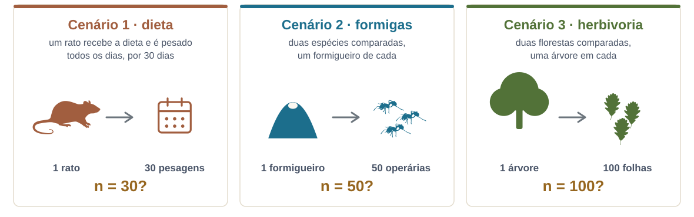
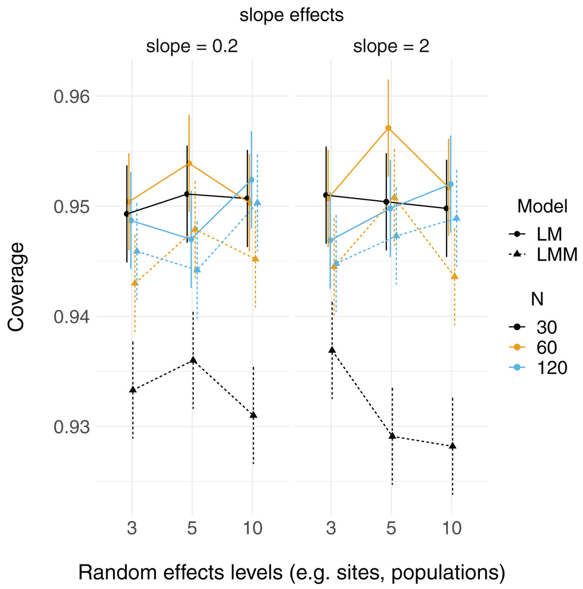

```{r}
#| echo: false
library(tidyverse)
library(lme4)
theme_set(theme_minimal(base_size = 14))
rikz <- read.table("../dados/RIKZ.txt", header = TRUE, row.names = 1) |>
  mutate(Beach = factor(Beach))
```

## Onde estamos no ciclo PPDAC

```{r}
#| echo: false
#| fig-width: 5.6
#| fig-height: 4.5
#| out-width: "36%"
#| fig-align: center
source("../R/ppdac.R")
ppdac_plot(destaque = c("Plano", "An\u00e1lise"))
```

O encontro em que **Plano** e **Análise** se encontram: a estrutura do modelo tem de espelhar a estrutura da amostragem.

---

## A premissa que ninguém cumpre {.secao}

Das quatro premissas do modelo linear, a mais importante é a
**independência** — e é a que quase todo delineamento ecológico viola.

::: {.definicao}
Duas amostras da mesma poça se parecem mais entre si do que com amostras
de outra poça. Duas medidas do mesmo indivíduo, idem. Isso é informação,
não ruído — e o modelo precisa saber disso.
:::

---

## Hoje

1. *Productive failure*
2. Pseudorreplicação
3. O que é um efeito aleatório
4. Fixo ou aleatório?
5. **Intervalo**
6. Intercepto e inclinação aleatórios
7. Anatomia de `lmer`: *shrinkage*, ICC, variâncias
8. O problema dos graus de liberdade

---

## *Productive failure*

Riqueza de invertebrados em 45 amostras, distribuídas em **9 praias**,
com a altura da amostra em relação ao nível do mar (NAP).

```{r}
#| echo: false
#| fig-height: 2.7
ggplot(rikz, aes(NAP, Richness, colour = Beach)) +
  geom_point(size = 2) +
  labs(x = "NAP", y = "Riqueza", colour = "Praia")
```

**Em grupos:** qual o *n* desta análise — 45 ou 9? E que diferença isso
faz?

---

# 1. Pseudorreplicação {.secao}

---

## Três cenários {.smaller}

Cinco minutos, em duplas. Em quais destes há réplica de verdade?

{fig-align="center" width="97%"}

::: {.definicao}
A pergunta que resolve os três: qual é a unidade que foi de fato
**replicada no fator que me interessa**?
:::

::: {.nota}
Silhuetas do [PhyloPic](https://www.phylopic.org), todas sob CC0 1.0:
*Rattus norvegicus* por Arcadia Science, *Solenopsis invicta* por
Richard J. Harris e a folha de *Quercus petraea* por Pablo Castro
Sánchez-Bermejo.
:::

---

## Os três são o mesmo erro {.smaller}

Em todos, o que se replicou foi a **medida**, não a unidade que recebe o
tratamento. O rato é um, o formigueiro é um, a árvore é uma. Trinta
pesagens do mesmo rato dizem muito sobre aquele rato e quase nada sobre a
dieta.

E repare que nenhum deles é erro de conta: os trinta pesos existem, foram
medidos com cuidado e estão corretos. O que não existe é a informação que
o *n* = 30 promete.

::: {.nota}
Não se conserta na análise: ou o delineamento replicou a unidade certa, ou
não replicou. O que dá para fazer — e é o resto desta manhã — é **modelar
a dependência** em vez de fingir que ela não existe.
:::

---

## A definição

::: {.definicao}
Tratar como réplicas independentes observações que compartilham a mesma
unidade experimental (Hurlbert 1984).
:::

O efeito prático é sempre o mesmo: o modelo acha que tem mais informação
do que tem, os erros-padrão encolhem, e o valor de *p* fica otimista.

---

## Cinco formas comuns em ecologia {.smaller}

1. **Temporal** — o mesmo sítio medido em vários meses.
2. **Espacial** — parcelas vizinhas dentro do mesmo fragmento.
3. **Filogenética** — espécies não são réplicas independentes: estão
   ligadas por ancestralidade comum, e as mais próximas tendem a ser mais
   parecidas. É o sinal filogenético.
4. **Indivíduo** — várias medidas do mesmo animal.
5. **Aninhamento de delineamento** — sub-amostras dentro de unidades
   tratadas.

::: {.nota}
Em nenhum desses casos a solução é "tirar a média por grupo". Isso joga
fora variação real e desperdiça graus de liberdade. As três primeiras têm
a mesma forma — pares mais próximos no espaço, no tempo ou na filogenia
são mais parecidos — e é por isso que os remédios se parecem: uma
estrutura de correlação que diz quem é vizinho de quem. Para a
filogenética, isso é PGLS ou modelo misto filogenético.
:::

---

## Vendo o estrago

```{r}
m_ing <- lm(Richness ~ NAP, data = rikz)                 # ignora a praia
m_mix <- lmer(Richness ~ NAP + (1 | Beach), data = rikz) # reconhece

c(lm_ep   = round(summary(m_ing)$coefficients["NAP", "Std. Error"], 3),
  lmer_ep = round(summary(m_mix)$coefficients["NAP", "Std. Error"], 3))
```

O modelo que ignora a estrutura de praias **promete mais precisão** do
que os dados sustentam.

---

## E a solução errada

```{r}
por_praia <- rikz |> group_by(Beach) |>
  summarise(Richness = mean(Richness), NAP = mean(NAP))
c(n_original = nrow(rikz), n_agregado = nrow(por_praia),
  ep_agregado = round(summary(lm(Richness ~ NAP, por_praia))$coefficients[2, 2], 3))
```

Agregar resolve a pseudorreplicação — e destrói a variação **dentro** das
praias, que é justamente onde o NAP varia mais.

---

# 2. O que é um efeito aleatório {.secao}

---

## Não é "uma variável que não interessa"

::: {.definicao}
Um efeito aleatório trata os níveis do fator como uma **amostra de uma
população de níveis**. O que se estima não são os níveis, e sim a
**variância** entre eles.
:::

Nove praias não são nove parâmetros: são nove desvios de uma distribuição
com desvio-padrão $\sigma_{\text{praia}}$, que é **um** parâmetro.

---

## O modelo, escrito

$$
y_{ij} = \underbrace{\beta_0 + \beta_1 x_{ij}}_{\text{efeitos fixos}}
       + \underbrace{b_j}_{\text{efeito aleatório}} + \varepsilon_{ij}
$$

$$
b_j \sim \mathcal{N}(0, \sigma^2_{\text{praia}}),
\qquad \varepsilon_{ij} \sim \mathcal{N}(0, \sigma^2)
$$

::: {.nota}
Repare que há **dois** níveis de variação agora. É por isso que "modelo
hierárquico" e "modelo multinível" são sinônimos de modelo misto.
:::

---

## As duas variâncias

```{r}
VarCorr(m_mix)
```

```{r}
vc <- as.data.frame(VarCorr(m_mix))
icc <- vc$vcov[1] / sum(vc$vcov)
round(icc, 3)
```

::: {.definicao}
**ICC** = proporção da variação total que está **entre** praias. Aqui,
`r round(icc*100)` % — ou seja, duas amostras da mesma praia se parecem
bastante. Ignorar isso seria caro.
:::

---

## Fixo ou aleatório?

| Pergunte | Fixo | Aleatório |
|---|---|---|
| Os níveis são os que interessam, ou uma amostra? | são estes | são uma amostra de muitos |
| Você quer estimar **cada** nível? | sim | não, quer a variância |
| Quantos níveis há? | poucos | idealmente ≥ 5 |
| Quer prever para níveis novos? | não dá | sim |

::: {.definicao}
"Espécie" pode ser fixo ou aleatório **na mesma tabela de dados** — o que
decide é a pergunta. Duas espécies comparadas: fixo. Quarenta espécies
como amostra de uma comunidade: aleatório.
:::

::: {.nota}
A tabela acima é uma regra de bolso, não uma definição. A seção
["Should I treat factor xxx as fixed or
random?"](https://bbolker.github.io/mixedmodels-misc/glmmFAQ.html#should-i-treat-factor-xxx-as-fixed-or-random)
do *GLMM FAQ*, de Ben Bolker e colaboradores, reúne cinco definições
diferentes de "efeito aleatório" catalogadas por Gelman (2005) — e elas
não coincidem. Vale ler antes de discutir com um revisor.
:::

---

## Poucos níveis {.smaller}

Com 3 ou 4 níveis, a variância do efeito aleatório é estimada com
péssima precisão — frequentemente colapsa para zero.

::: {.nota}
Regra prática comum: abaixo de 5 níveis, considere tratar como fixo.
Não é uma lei; é um aviso de que você tem pouca informação para estimar
uma variância.
:::

---

## Poucos níveis: depende do que você quer {.smaller}

:::: {.columns}

::: {.column width="44%"}
{fig-align="center" height="440"}
:::

::: {.column width="56%"}
No eixo *y*, a **cobertura** do intervalo de 95% dos efeitos fixos: em
quantas das 10 mil simulações o valor verdadeiro caiu dentro do
intervalo. No eixo *x*, o número de níveis do fator de agrupamento.

Ela fica em torno de 0,95 com 3, 5 ou 10 níveis. A única série
claramente abaixo é o modelo misto com *n* = 30 — o que derruba a
cobertura é o **tamanho amostral**, não o número de níveis.

Se o agrupamento entra só para acomodar a dependência — um *nuisance* —
menos de cinco níveis pode ser aceitável. Se a variância entre grupos
**é** a sua pergunta, a regra continua valendo: essa variância segue
subestimada com poucos níveis.
:::

::::

::: {.nota}
Figura 2 de Gomes, D.G.E. 2022. [Should I use fixed effects or random
effects when I have fewer than five levels of a grouping factor in a
mixed-effects model?](https://doi.org/10.7717/peerj.12794) *PeerJ*
10:e12794, sob CC BY 4.0. O próprio autor fecha pedindo mais simulações
antes de generalizar.
:::

---

# Intervalo {.secao}

15 minutos.

Na volta: intercepto e inclinação aleatórios.

---

# 3. Intercepto e inclinação {.secao}

---

## Três modelos possíveis

```{r}
m1 <- lm(Richness ~ NAP, data = rikz)                        # uma reta só
m2 <- lmer(Richness ~ NAP + (1 | Beach), data = rikz)        # interceptos variam
m3 <- lmer(Richness ~ NAP + (NAP | Beach), data = rikz)      # e inclinações também
```

- `(1 | Beach)` — cada praia tem sua própria riqueza basal.
- `(NAP | Beach)` — cada praia tem também sua própria resposta ao NAP.

---

## Desenhados

```{r}
#| fig-height: 3.2
#| echo: false
pred <- rikz |> mutate(
  `Sem efeito aleatório` = predict(m1),
  `Intercepto aleatório` = predict(m2),
  `Intercepto + inclinação` = predict(m3)) |>
  pivot_longer(c(`Sem efeito aleatório`, `Intercepto aleatório`,
                 `Intercepto + inclinação`), names_to = "modelo", values_to = "fit") |>
  mutate(modelo = factor(modelo, c("Sem efeito aleatório", "Intercepto aleatório",
                                   "Intercepto + inclinação")))
ggplot(pred, aes(NAP, fit, colour = Beach)) +
  geom_line() +
  geom_point(aes(y = Richness), size = 1, alpha = .5) +
  facet_wrap(~modelo) +
  labs(x = "NAP", y = "Riqueza") +
  theme(legend.position = "none")
```

---

## A sintaxe, resumida

+----------------------+--------------------------------------------------+
| Fórmula              | Significado                                      |
+======================+==================================================+
| `(1 | g)`            | intercepto aleatório por `g`                     |
+----------------------+--------------------------------------------------+
| `(x | g)`            | intercepto e inclinação de `x`, correlacionados  |
+----------------------+--------------------------------------------------+
| `(0 + x | g)`        | só inclinação                                    |
+----------------------+--------------------------------------------------+
| `(1 | g/h)`          | `h` aninhado em `g`                              |
+----------------------+--------------------------------------------------+
| `(1 | g) + (1 | h)`  | fatores cruzados                                 |
+----------------------+--------------------------------------------------+

::: {.nota}
Aninhado × cruzado é fonte constante de erro. Regra: se o nível "1" de
`h` na praia A **não é o mesmo** que o "1" da praia B, é aninhado. A
seção ["Model
specification"](https://bbolker.github.io/mixedmodels-misc/glmmFAQ.html#model-specification)
do *GLMM FAQ* traz esta mesma tabela com mais linhas, cada fórmula ao
lado da equação correspondente, e um conselho que evita o problema na
origem: nomeie os níveis aninhados de forma única (A1, A2, …, B1, B2, …),
e aí não há como confundir aninhado com cruzado.
:::

---

## *Shrinkage*

```{r}
#| fig-height: 3.0
#| echo: false
sep <- rikz |> group_by(Beach) |>
  summarise(intercepto = coef(lm(Richness ~ NAP))[1], n = n())
misto <- coef(m2)$Beach[, "(Intercept)"]
tibble(Beach = sep$Beach, n = sep$n, separado = sep$intercepto, misto = misto) |>
  pivot_longer(c(separado, misto)) |>
  ggplot(aes(value, fct_reorder(Beach, value), colour = name)) +
  geom_point(size = 3) +
  scale_colour_manual(values = c("#c08a3e", "#1c6e8c"),
                      labels = c("modelo misto", "regressão separada")) +
  labs(x = "Intercepto estimado", y = "Praia", colour = NULL)
```

As estimativas do modelo misto são **puxadas para a média geral** — mais
ainda nas praias com menos amostras.

---

## Por que isso é bom

::: {.definicao}
*Shrinkage* não é um defeito: é o modelo reconhecendo que uma média
baseada em 3 amostras é menos confiável que uma baseada em 9, e pedindo
emprestada informação das outras praias.
:::

É o mesmo princípio da regularização bayesiana — e, de fato, um efeito
aleatório **é** uma prior sobre os níveis do fator. Voltamos a isso à
tarde.

---

# 4. Graus de liberdade {.secao}

---

## O incômodo

```{r}
summary(m_mix)$coefficients
```

Sem coluna de valor de *p*. Isso é deliberado: **não há um número exato
de graus de liberdade** para o denominador num modelo misto desbalanceado.

---

## As saídas {.smaller}

| Abordagem | Como |
|---|---|
| Aproximação de Satterthwaite | `lmerTest::lmer()` — dá a coluna de *p* |
| Kenward–Roger | `pbkrtest` — mais conservador, melhor em amostra pequena |
| Razão de verossimilhanças | `anova(m0, m1)` — cuidado com `REML` |
| Intervalo de confiança | `confint(m, method = "profile")` |
| Teste por termo | `car::Anova(m, type = "II")` — qui-quadrado de Wald |
| Tabela pronta | [`parameters::model_parameters()`](https://easystats.github.io/parameters/reference/model_parameters.glmmTMB.html) — estimativa, IC e *p* numa tabela só, com `ci_method` à sua escolha |
| Bayesiano | intervalo de credibilidade, sem o problema |

---

## E o `glmmTMB`? {.smaller}

Ele **imprime** valor de *p* no `summary()`, e o `lmer` não. Isso não é
porque o problema foi resolvido: o `glmmTMB` usa o grau de liberdade do
denominador como **infinito** — a estatística é um *z* de Wald
assintótico. O `lmer` se recusa a fazer essa aproximação em silêncio.

::: {.definicao}
Com muitos níveis e amostra grande, a aproximação assintótica é
inofensiva. Com poucos níveis ou amostra pequena, ela é
**anticonservadora**: o *p* sai menor do que deveria.
:::

::: {.nota}
Para testar um termo inteiro — um fator com vários níveis, uma interação
— use [`car::Anova()`](https://cran.r-project.org/web/packages/glmmTMB/refman/glmmTMB.html#Anova.glmmTMB)
sobre o ajuste do `glmmTMB`; o único teste disponível ali é o
qui-quadrado de Wald. E o `parameters::model_parameters()` monta a tabela
de saída dos dois mundos, aceitando `ci_method = "satterthwaite"` ou
`"kenward"` quando o modelo permite.
:::

---

## A recomendação prática

```{r}
round(confint(m_mix, method = "Wald", parm = "NAP"), 3)
```

::: {.definicao}
Relate **estimativa e intervalo**, não o valor de *p*. O intervalo
responde à pergunta biológica ("de quanto é o efeito?") e contorna a
discussão sobre graus de liberdade.
:::

---

## O que o *p* não diz {.smaller}

A declaração da ASA sobre valores de *p* tem seis princípios. Três deles
caem exatamente aqui:

- **3.** Nenhuma conclusão científica deve depender só de o *p* cruzar um
  limiar.
- **4.** Inferência honesta exige relato completo e transparência.
- **5.** O valor de *p*, ou a significância estatística, **não mede o
  tamanho de um efeito** nem a importância de um resultado.

::: {.definicao}
O intervalo do slide anterior responde "de quanto é, nas unidades em que
eu medi". O **tamanho de efeito** responde "de quanto é, numa unidade
comparável entre estudos".
:::

::: {.nota}
Wasserstein, R.L. & Lazar, N.A. 2016. [The ASA Statement on *p*-Values:
Context, Process, and
Purpose](https://doi.org/10.1080/00031305.2016.1154108). *The American
Statistician* 70:129–133.
:::

---

## Tamanho de efeito no R {.smaller}

```{r}
library(effectsize)

standardize_parameters(m_mix)
```

O `NAP` vale **−0,51 desvio-padrão de riqueza** por desvio-padrão de
altura — um número que atravessa estudos com outras réguas.

::: {.nota}
O [`effectsize`](https://easystats.github.io/effectsize/) cobre as
famílias todas: `cohens_d()` e `hedges_g()` para diferenças padronizadas,
`eta_squared()` e `omega_squared()` para variância explicada,
`cramers_v()` para tabelas de contingência, e conversões entre elas
(`d_to_r()`, `oddsratio_to_riskratio()`). A família `interpret_*()`
traduz o número em "pequeno/médio/grande" segundo regras que você escolhe
— `cohen1988`, `gignac2016`, `funder2019`. Escolher a régua já é uma
decisão sua: elas são convenções, não medidas. Ben-Shachar, M.S.;
Lüdecke, D. & Makowski, D. 2020. [effectsize](https://doi.org/10.21105/joss.02815).
*Journal of Open Source Software* 5(56):2815.
:::

---

## REML ou ML?

- **REML** (padrão do `lmer`) — estima as variâncias sem viés. Use para
  o modelo final e para comparar **estruturas aleatórias**.
- **ML** — use para comparar modelos com **efeitos fixos diferentes**
  (inclusive por AIC).

```{r}
#| eval: false
m_a <- lmer(y ~ x1 + x2 + (1 | g), data = d, REML = FALSE)
m_b <- lmer(y ~ x1      + (1 | g), data = d, REML = FALSE)
anova(m_a, m_b)
```

::: {.nota}
Comparar efeitos fixos com REML é um erro silencioso — o `anova.merMod`
reajusta com ML automaticamente e avisa, mas o AIC calculado à mão, não.
:::

---

# Fechamento {.secao}

---

## O que fica de hoje

1. A estrutura do modelo deve espelhar a estrutura da **amostragem**.
2. Efeito aleatório estima uma **variância**, não níveis.
3. A escolha fixo/aleatório depende da pergunta, não do dado.
4. *Shrinkage* é o modelo pesando a confiabilidade de cada grupo.
5. Relate estimativa e intervalo; o debate sobre graus de liberdade some.

---

## Prática (o resto do bloco)

1. Liste a estrutura de agrupamento dos **seus** dados. Escreva a fórmula
   do efeito aleatório correspondente.
2. Ajuste o modelo com e sem o efeito aleatório e compare os
   erros-padrão.
3. Calcule o ICC e interprete em uma frase.
4. Ajuste também com inclinação aleatória. Convergiu? Se não, por quê?

---

## Para a tarde

**Checklist:** Harrison, X.A. et al. 2018. A brief introduction to mixed
effects modelling and multi-model inference in ecology. *PeerJ*.

**À tarde:** respostas não gaussianas com efeitos aleatórios — e o mesmo
modelo em bayesiano.

---

## Referências

::: {.nota}
- Bolker, B.M. et al. 2009. [Generalized linear mixed models: a practical guide for ecology and evolution](https://doi.org/10.1016/j.tree.2008.10.008). *Trends in Ecology & Evolution* 24:127–135.
- Wasserstein, R.L. & Lazar, N.A. 2016. [The ASA Statement on *p*-Values: Context, Process, and Purpose](https://doi.org/10.1080/00031305.2016.1154108). *The American Statistician* 70:129–133.
- Ben-Shachar, M.S.; Lüdecke, D. & Makowski, D. 2020. [effectsize: Estimation of Effect Size Indices and Standardized Parameters](https://doi.org/10.21105/joss.02815). *Journal of Open Source Software* 5(56):2815.
- Gomes, D.G.E. 2022. [Should I use fixed effects or random effects when I have fewer than five levels of a grouping factor in a mixed-effects model?](https://doi.org/10.7717/peerj.12794). *PeerJ* 10:e12794.
- Bolker, B.M. e colaboradores. [*GLMM FAQ*](https://bbolker.github.io/mixedmodels-misc/glmmFAQ.html) — a referência viva sobre modelos mistos em R: o que é efeito aleatório, quantos níveis bastam, convergência, teste de hipótese.
- Harrison, X.A. et al. 2018. [A brief introduction to mixed effects modelling and multi-model inference in ecology](https://doi.org/10.7717/peerj.4794). *PeerJ* 6:e4794.
- Hurlbert, S.H. 1984. [Pseudoreplication and the design of ecological field experiments](https://doi.org/10.2307/1942661). *Ecological Monographs* 54:187–211.
- Zuur, A.F. et al. 2009. [*Mixed Effects Models and Extensions in Ecology with R*](https://doi.org/10.1007/978-0-387-87458-6). Springer.
:::
